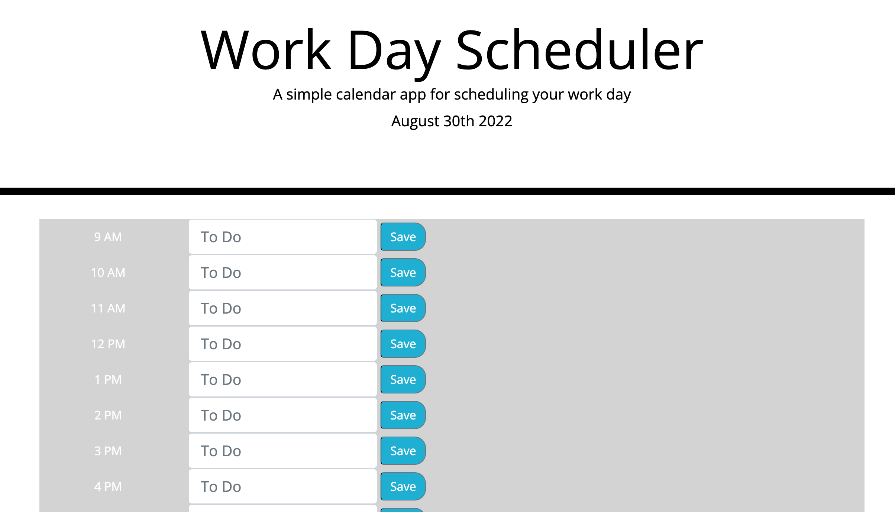

# Workday Hourly Planner

## Purpose

To create an hourly planner for the workday, where the entries for the hours persist across refresh, and the time slots are color coded to past, present and future. 

## Built With
 - HTML
 - CSS
 - JavaScript
 - JQuery
 - Moment
 - Bootstrap

 ## Website

https://alexdefrese.github.io/Defrese-Schedule-Planner/

 ## Contribution
Made with ❤️ by Alex Defrese

